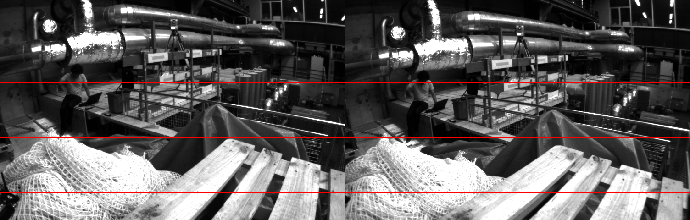
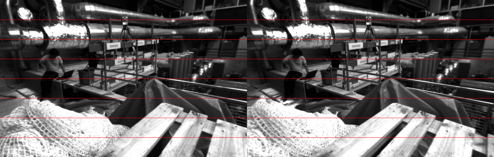

# Opencv stereoRectify函数详解


## 函数的[官方解释](https://docs.opencv.org/4.x/d9/d0c/group__calib3d.html#ga617b1685d4059c6040827800e72ad2b6)
### 函数原型

```cpp
void cv::stereoRectify 	(   InputArray  cameraMatrix1,
                            InputArray  distCoeffs1,
                            InputArray  cameraMatrix2,
                            InputArray  distCoeffs2,
                            Size        imageSize,
                            InputArray  R,
                            InputArray  T,
                            OutputArray R1,
                            OutputArray R2,
                            OutputArray P1,
                            OutputArray P2,
                            OutputArray Q,
                            int         flags = CALIB_ZERO_DISPARITY,
                            double      alpha = -1,
                            Size        newImageSize = Size(),
                            Rect *      validPixROI1 = 0,
                            Rect *      validPixROI2 = 0 
	) 	
```

函数作用是得到矫正的双目图像所需的变换矩阵和投影矩阵，然后可以传给 initUndistortRectifyMap 函数生成矫正图像到原始图像的像素坐标的映射，最后使用 remap 函数得到校正的双目图像。  
上面说的校正的双目图像特点是：1. 双目相机的成像平面为同一平面；2. 左右目图像同一极线平行且极线上所有点的 y 坐标相等。

### 参数说明：
#### 输入参数：
`cameraMatrix1`：左目相机内参矩阵  
`distCoeffs1`：左目相机畸变参数  
`cameraMatrix2`：右目相机内参矩阵  
`distCoeffs2`：右目相机畸变参数  
`imageSize`：图像大小  
`R`：左目相机坐标系到右目相机坐标系的旋转变换，即 $R_{rl}$  
`T`：左目相机坐标系到右目相机坐标系的平移变换，即 $t_{rl}$  

`flags`：如果设置为 `CALIB_ZERO_DISPARITY`，函数会将两个相机的 principal point 设成一样。否则就会平移图像最大化有用的图像区域。  
`alpha`：自由缩放参数。如果设置为 -1 或者不设置，函数执行默认缩放。否则参数应为 0-1 。0：矫正图像会放大和平移使得最终图像中只有有效像素；1：图像会缩小和平移使得原始图像中所有像素都可见。  
`newImageSize`：矫正后的图像分辨率。默认（0，0），设置为原始图像大小。设置为高的分辨率可以保持原始图像的更多细节，特别是畸变较大的时候。  
`validPixROI1`：一个最多地包含有效像素的长方形。（左目图像）  
`validPixROI2`：一个最多地包含有效像素的长方形。（右目图像）  
#### 输出参数：
`R1`：矫正旋转矩阵。将第一个相机坐标系下未矫正的点变换到第一个相机矫正坐标系下，即 R_{左矫正坐标系}{左未矫正坐标系}  
`R2`：矫正旋转矩阵。将第二个相机坐标系下未矫正的点变换到第二个相机矫正坐标系下，即 R_{右矫正坐标系}{右未矫正坐标系}  
`P1`：3x4左相机投影矩阵。将左矫正坐标系下的点投影到左矫正坐标系图像平面坐标系。  
`P2`：3x4右相机投影矩阵。将左矫正坐标系下的点投影到右矫正坐标系图像平面坐标系。  
`Q`：4x4的视差深度映射矩阵。  

对于水平双目相机（大部分的双目相机），其中 P1, P2, Q 定义如下：

$$
\begin{aligned}
\texttt{P2} &= \begin{bmatrix} f & 0 & cx_2 & T_x \cdot f \\ 0 & f & cy & 0 \\ 0 & 0 & 1 & 0 \end{bmatrix} ,\\
\texttt{P2} &= \begin{bmatrix} f & 0 & cx_2 & T_x \cdot f \\ 0 & f & cy & 0 \\ 0 & 0 & 1 & 0 \end{bmatrix} ,\\
\texttt{Q} &= \begin{bmatrix} 1 & 0 & 0 & -cx_1 \\ 0 & 1 & 0 & -cy \\ 0 & 0 & 0 & f \\ 0 & 0 & -\frac{1}{T_x} & \frac{cx_1 - cx_2}{T_x} \end{bmatrix}
\end{aligned}
$$


### 函数代码测试
我们使用EuRoC MAV数据集的双目相机参数对这个函数做测试：  

```cpp
#include <opencv2/core.hpp>
#include <opencv2/calib3d.hpp>
#include <opencv2/imgproc.hpp>
#include <opencv2/highgui.hpp>
#include <iostream>
#include <Eigen/Core>
#include <Eigen/Geometry>

using namespace cv;
using namespace std;

int main(int argc, char **argv)
{
    if(argc != 3){
        cerr << "Error: please input 2 images." << endl;
        return -1;
    }

    // Euroc 数据集双目相机内参
    Mat Kl = ( Mat_<float>(3,3) << 458.654, 0., 367.215, 
                                    0., 457.296, 248.375, 
                                    0., 0., 1.);
    Mat Kr = ( Mat_<float>(3,3) << 457.587, 0., 379.999, 
                                    0., 456.134, 255.238, 
                                    0., 0., 1.);

    Mat Dl = ( Mat_<float>(1,4) << -0.28340811, 0.07395907, 0.00019359, 1.76187114e-05 );       // 畸变参数
    Mat Dr = ( Mat_<float>(1,4) << -0.28368365,  0.07451284, -0.00010473, -3.55590700e-05 );

    // 双目相机相对位姿
    Mat R_rl = ( Mat_<double>(3,3) <<    9.99997256e-01,   2.31206719e-03,   3.76008102e-04, 
	                                    -2.31713572e-03,   9.99898049e-01,   1.40898358e-02,
	                                    -3.43393121e-04,  -1.40906685e-02,   9.99900663e-01 );
    Mat t_rl = ( Mat_<double>(3,1) << -0.11007381,  0.00039912, -0.0008537 );       // 变换的数据类型需要时double的，不然之后执行opencv的函数会报错
    
    Mat img_src_l = imread(argv[1], IMREAD_UNCHANGED);    // 读取左右目图像
    Mat img_src_r = imread(argv[2], IMREAD_UNCHANGED);

    cout << "read images finished. " << endl;

    int width = img_src_l.cols, height = img_src_l.rows;
    Mat Rl, Rr, Pl, Pr, Q;
    Mat undistmap1l, undistmap2l, undistmap1r, undistmap2r;

    stereoRectify( Kl, Dl, Kr, Dr, Size(width, height), R_rl, t_rl, Rl, Rr, Pl, Pr, Q, cv::CALIB_ZERO_DISPARITY, 0 );
    cout << "stereo rectify finished. " << endl;
    initUndistortRectifyMap( Kl, Dl, Rl, Pl, cv::Size(width,height), CV_16SC2, undistmap1l, undistmap2l );
    initUndistortRectifyMap( Kr, Dr, Rr, Pr, cv::Size(width,height), CV_16SC2, undistmap1r, undistmap2r );

    // 将 R_21 和 t_21 转换为两个校正相机坐标系的变换
    cout << "R_rl before rectification: " << endl << R_rl << endl;
    R_rl = Rr * R_rl * Rl.t();
    cout << "R_rl after rectification: " << endl << R_rl << endl;

    cout << "t_rl before rectification: " << endl << t_rl.t() << endl;
    t_rl = Rr * t_rl;
    cout << "t_rl after rectification: " << endl << t_rl.t() << endl;

    // 打印投影矩阵
    cout << "Pl: " << endl << Pl << endl;
    cout << "Pr: " << endl << Pr << endl;

    // 得到校正图像
    Mat img_rtf_l, img_rtf_r;
    remap( img_src_l, img_rtf_l, undistmap1l, undistmap2l, cv::INTER_LINEAR );
    remap( img_src_r, img_rtf_r, undistmap1r, undistmap2r, cv::INTER_LINEAR );

    Mat img_src, img_rtf;
    hconcat(img_src_l, img_src_r, img_src);
    hconcat(img_rtf_l, img_rtf_r, img_rtf);

    cvtColor(img_src, img_src, COLOR_GRAY2BGR);
    cvtColor(img_rtf, img_rtf, COLOR_GRAY2BGR);

    // 绘制平行线
    for(int i = 1, iend = 8; i < iend; i++){
        int h = height/iend * i;
        line(img_src, Point2i(0, h), Point2i(width*2, h), Scalar(0,0,255));
        line(img_rtf, Point2i(0, h), Point2i(width*2, h), Scalar(0,0,255));
    }

    imshow("image_src", img_src);
    imshow("image_rtf", img_rtf);

    waitKey(0);

    return 0;
}
```

校正前后 左目相机到右目相机的旋转矩阵：

```shell
R_rl before rectification: 
[0.999997256, 0.00231206719, 0.000376008102;
 -0.00231713572, 0.999898049, 0.0140898358;
 -0.000343393121, -0.0140906685, 0.999900663]
R_rl after rectification: 
[0.999999999522207, -2.395107227679009e-12, 6.39099232960692e-12;
 -2.39902704968578e-12, 1.000000000493077, -4.695780200869464e-11;
 6.390414450718838e-12, -4.698293904886045e-11, 1.00000000036201]
```

校正后的旋转矩阵几乎与单位矩阵相等，说明两个相机的成像平面平行。

校正前后 左目相机到右目相机的平移向量：

```shell
t_rl before rectification: 
[-0.11007381, 0.00039912, -0.0008537]
t_rl after rectification: 
[-0.1100778440394819, -1.899859817072477e-16, 5.956099065901966e-16]
```

校正后两个相机的位置仅在x方向上存在偏移，又因为两个相机成像平面平行，所以两个相机的成像平面为为同一平面。

校正后的投影矩阵：

```shell
Pl: 
[436.2345881250716, 0, 364.4412384033203, 0;
 0, 436.2345881250716, 256.9516830444336, 0;
 0, 0, 1, 0]
Pr: 
[436.2345881250716, 0, 364.4412384033203, -48.01976295625924;
 0, 436.2345881250716, 256.9516830444336, 0;
 0, 0, 1, 0]
```

左侧 3x3 的矩阵为内参矩阵。  
因为参数 `flags` 设置为 `CALIB_ZERO_DISPARITY`，所以校正后的两个相机的 principal point 相等，进而内参矩阵相等。

在校正前后双目图像中绘制与 x 轴平行的直线：





校正后左右目图像同一极线平行且极线上所有点的 y 坐标相等。