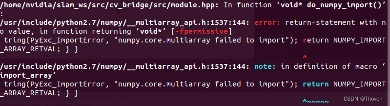

# 解决 cv_bridge 与 opencv4 版本冲突问题

*解决了在 ROS melodic / noetic 下 cv_bridge 与 opencv4 版本冲突导致的 opencv 操作 导致 Segmentation fault (core dumped) 的问题。*

## 问题描述
在 ubuntu18.04 ROS melodic 下整理好 ORBSLAM3 ROS 功能包后，编译通过，但是运行节点时出现段错误：```Segmentation fault (core dumped)```。  
发现错误发生在使用 opencv4 的 cv::FileStorage 读取 yaml 文件处，而这个错误在运行非 ROS 版本的 ORBSLAM3 程序时并不会发生。  
即以下代码无法执行：

```cpp
cv::FileStorage fsSetting("yaml文件路径", cv::FileStorage::READ);
if(!fsSettings.isOpened()){
    cerr << "Failed to open settings file at: " << path << endl;
    exit(-1);
}
```
当然除了cv::FileStorage，其他 opencv 的操作也可能导致错误。  
最后发现在 CMakeLists.txt 中不添加 cv_bridge 包，cv::FileStorage 就能正常读取文件：

```yaml
find_package(catkin REQUIRED COMPONENTS
    # cv_bridge
)
```

后来在ubuntu20.04 ROS noetic 下同样是编译通过，运行节点出现段错误，但是出现段错误的点不在 cv::FileStorage 读取 yaml 文件处。

因为 melodic 版本的 cv_bridge 功能包中所用 opencv 版本为 opencv3，所以原因应该是 **cv_bridge 与 opencv4 版本冲突**。  
noetic 版本的 cv_bridge 功能包使用的是 opencv4，但是同样会因为 opencv4 版本不一致出现冲突，而在 catkin_make 结束后该冲突只以 warning 的形式提示。  

## 解决方法
解决问题的方法是通过 **将 cv_bridge 和 我们自己功能包的依赖设为同一版本的 opencv**。

采用重新编译 cv_bridge 功能包的方法，解决该冲突问题。

1. 下载 cv_bridge  
    下载 noetic 版本的 cv_bridge。（noetic 版本的 cv_bridge 在 melodic 下也能使用，不过要做一些修改，后续会说明）  
    下载地址：```https://github.com/ros-perception/vision_opencv/tree/noetic```  
    下载完成后，将 cv_bridge 拷贝到 ros 工作空间的 src 文件夹下。  
    为了不影响原来的包，将该文件夹重命名为 cv_bridge_new，并且将 CMakelists.txt 文件中 project 名称修改为 cv_bridge_new：

	```python
	project(cv_bridge_new)
	```

	并且修改 package.xml 中包的名称：

	```xml
	<package format="2">
	  <name>cv_bridge_new</name>
	  ...
	```

	在 CMakelists.txt 文件中指定我们自己的功能包中所用的 opencv4：

	```python
	...
	set(OpenCV_DIR opencv路径/opencv/build)
	set(_opencv_version 4)
	find_package(OpenCV 4 QUIET)
	...
	```

2. 编译 cv_bridge  
	cd 到工作空间的根目录，执行 ```catkin_make```
	在 noetic 版本下直接编译成功，生成名为 cv_bridge_new 的包。
	接下来在自己的功能包中使用 cv_bridge_new 包就行。可跳过去看第 3 步。
	
	如果是 melodic ，会出现两个问题：  
	① 编译过程中会报错：

	```shell
	Could not fild the following Boost libraries:
	boost_python37
	```

	**找不到 boost_python37 库**。
	在 /usr/lib 文件夹下查找 boost_python ，其实是有这个库的，只不过名字尾缀不为python37，而是 python3。
	可以通过建立软链接的方式让 CMake 找到该库，网上有解决方案。
	也可以 **直接修改 CMakeLists.txt 文件**：

	```shell
	...
	if(PYTHONLIBS_VERSION_STRING VERSION_LESS "3.8")
	# Debian Buster
	find_package(Boost REQUIRED python3)
	...
	```

	② 重新编译，发现还是会有错误。

    

    参考博客1，**修改 cv_bridge_new/src/module.hpp 文件下 ```void* do_numpy_import()```函数** 为：

	```cpp
	static void do_numpy_import( )
	{
	    import_array( );
	}
	```

	修改完成后就能成功通过编译。

3. 使用 cv_bridge_new 包  
    在自己的功能包中，**修改 CMakeList.txt 文件**：

	```python
	find_package(catkin REQUIRED COMPONENTS
		cv_bridge_new
	)
	```

	**修改 package.xml 文件**：

	```xml
	...
	<build_depend>cv_bridge_new</build_depend>
	...
	<exec_depend>cv_bridge_new</exec_depend>
	...
	```

	注意源文件不需要做任何修改，即不需要修改源文件 include 的 cv_bridge 的头文件路径，虽然我们编译生成的包名修改为了 cv_bridge_new。（参考博客 [2] 中修改源文件的步骤是错误的）
	重新编译，运行节点就能正常使用 opencv4 。
	

## 参考
[1] 解决ROS配置中cv_bridge问题：```https://zhuanlan.zhihu.com/p/347455336```  
[2] ROS学习：cv_bridge与opencv版本冲突三种解决方案：```https://blog.csdn.net/qinqinxiansheng/article/details/120219388```