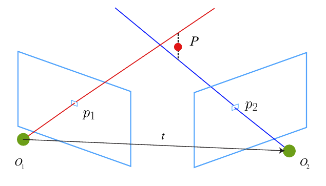

# 三角化
三角化是指在不同的位置对同一路标点进行观测，从而推断路标点的位置。

{:height="50%" width="50%"}

## 视觉SLAM14讲中的方法

$$
s_2 \mathbf{x}_2 = s_1 \mathbf{R} \mathbf{x}_1 + \mathbf{t}
$$

我们希望计算 $s_1$，对上式两侧左乘 $\mathbf{x}_2^{\wedge}$

$$
s_2 \mathbf{x}_2^{\wedge} \mathbf{x}_2 = 0 = s_1 \mathbf{x}_2^{\wedge} \mathbf{R} \mathbf{x}_1 + \mathbf{x}_2^{\wedge} \mathbf{t}
$$

由方程可以求得 $s_1$，进而也可以求得 $s_2$。

但是由于噪声的存在，$\mathbf{R}$ 和 $\mathbf{t}$ 并不能精确地使上式为 0。常见的方法是求最小二乘解。

- 代码  
使用OpenCV中的 triangulation 函数进行三角化

```cpp
void triangulation(
    const vector<KeyPoint> &keypoint_1,
    const vector<KeyPoint> &keypoint_2,
    const std::vector<DMatch> &matches,
    const Mat &R, const Mat &t,
    vector<Point3d> &points) {
    Mat T1 = (Mat_<float>(3, 4) <<
        1, 0, 0, 0,
        0, 1, 0, 0,
        0, 0, 1, 0);
    Mat T2 = (Mat_<float>(3, 4) <<
        R.at<double>(0, 0), R.at<double>(0, 1), R.at<double>(0, 2), t.at<double>(0, 0),
        R.at<double>(1, 0), R.at<double>(1, 1), R.at<double>(1, 2), t.at<double>(1, 0),
        R.at<double>(2, 0), R.at<double>(2, 1), R.at<double>(2, 2), t.at<double>(2, 0)
    );

    Mat K = (Mat_<double>(3, 3) << 520.9, 0, 325.1, 0, 521.0, 249.7, 0, 0, 1);
    vector<Point2f> pts_1, pts_2;
    for (DMatch m:matches) {
        // 将像素坐标转换至相机坐标
        pts_1.push_back(pixel2cam(keypoint_1[m.queryIdx].pt, K));
        pts_2.push_back(pixel2cam(keypoint_2[m.trainIdx].pt, K));
    }

    Mat pts_4d;
    cv::triangulatePoints(T1, T2, pts_1, pts_2, pts_4d);

    // 转换成非齐次坐标
    for (int i = 0; i < pts_4d.cols; i++) {
        Mat x = pts_4d.col(i);
        x /= x.at<float>(3, 0); // 归一化
        Point3d p(
            x.at<float>(0, 0),
            x.at<float>(1, 0),
            x.at<float>(2, 0)
        );
        points.push_back(p);
    }
}

Point2f pixel2cam(const Point2d &p, const Mat &K) {
    return Point2f
        (
        (p.x - K.at<double>(0, 2)) / K.at<double>(0, 0),
        (p.y - K.at<double>(1, 2)) / K.at<double>(1, 1)
        );
}
```

## vins中的方法
已知匹配点对 $\mathbf{x}$ 和 $\mathbf{x}'$，以及各自的相机矩阵 $\mathbf{P}$ 和 $\mathbf{P}'$，求三维点 $\mathbf{X}$（齐次坐标）

$$
\begin{aligned}
\mathbf{x} &= \mathbf{P}\mathbf{X} \\
s\left(\begin{array}{c}
x \\
y \\
1
\end{array}\right) &= \left(\begin{array}{llll}
p_1 & p_2 & p_3 & p_4\\
p_5 & p_6 & p_7 & p_8\\
p_9 & p_{10} & p_{11} & p_{12}
\end{array}\right)\left(\begin{array}{c}
X \\
Y \\
Z \\
1
\end{array}\right) \\
s\left(\begin{array}{c}
x \\
y \\
1
\end{array}\right) &= \left(\begin{array}{c}
\mathbf{p}_0 \\
\mathbf{p}_1 \\
\mathbf{p}_2 \\
\end{array}\right)\left(\begin{array}{c}
X \\
Y \\
Z \\
1
\end{array}\right) \\
\mathbf{0} &= \left(\begin{array}{c}
x \\
y \\
1
\end{array}\right)^{\wedge}\left(\begin{array}{c}
\mathbf{p}_0 \\
\mathbf{p}_1 \\
\mathbf{p}_2 \\
\end{array}\right)\left(\begin{array}{c}
X \\
Y \\
Z \\
1
\end{array}\right) \\
\left(\begin{array}{c}
y\mathbf{p}_2 - \mathbf{p}_1 \\
\mathbf{p}_0 - x\mathbf{p}_2 \\
x\mathbf{p}_1 - y\mathbf{p}_0 \\
\end{array}\right)\mathbf{X} &= \mathbf{0}
\end{aligned}
$$

由两个观测得到方程组：

$$
\left(\begin{array}{c}
x\mathbf{p}_2 - \mathbf{p}_0 \\
y\mathbf{p}_2 - \mathbf{p}_1 \\
x'\mathbf{p}_2' - \mathbf{p}_0' \\
y'\mathbf{p}_2' - \mathbf{p}_1' \\
\end{array}\right)_{4 \times 4}\mathbf{X}_{4 \times 1} = \mathbf{0}
$$

然后就组成了一个四元一次正定方程组，运用[SVD求解齐次方程](http://127.0.0.1:4000/%E8%A7%86%E8%A7%89SLAM/%E5%9F%BA%E7%A1%80/%E5%A5%87%E5%BC%82%E5%80%BC%E5%88%86%E8%A7%A3(SVD).html)，矩阵 $\mathbf{V}^{T}$ 的最后一行就是最终的解。
得到的是一个4维的齐次坐标，取出前3维，除以第4维就是三维点坐标。

- 代码

```cpp
/**
 * @brief svd方法求解三维坐标
 * 
 * @param Pose0 T_clw
 * @param Pose1 T_crw
 * @param point0 pl 归一化坐标
 * @param point1 pr 归一化坐标
 * @param point_3d 需要计算得到的 3d 点
 */
void FeatureManager::triangulatePoint(Eigen::Matrix<double, 3, 4> &Pose0, Eigen::Matrix<double, 3, 4> &Pose1,
                        Eigen::Vector2d &point0, Eigen::Vector2d &point1, Eigen::Vector3d &point_3d)
{
    Eigen::Matrix4d design_matrix = Eigen::Matrix4d::Zero();
    design_matrix.row(0) = point0[0] * Pose0.row(2) - Pose0.row(0);     // x*p2  - p0
    design_matrix.row(1) = point0[1] * Pose0.row(2) - Pose0.row(1);     // y*p2  - p1
    design_matrix.row(2) = point1[0] * Pose1.row(2) - Pose1.row(0);     // x'*p2'- p0'
    design_matrix.row(3) = point1[1] * Pose1.row(2) - Pose1.row(1);     // y'*p2'- p1'
    Eigen::Vector4d triangulated_point;
    triangulated_point =
              design_matrix.jacobiSvd(Eigen::ComputeFullV).matrixV().rightCols<1>();
    point_3d(0) = triangulated_point(0) / triangulated_point(3);    // 使最后一维等于 1 
    point_3d(1) = triangulated_point(1) / triangulated_point(3);
    point_3d(2) = triangulated_point(2) / triangulated_point(3);
}

/**
 * @brief 新检测的特征双目三角化，将计算feature中特征点在左目坐标系下的深度estimated_depth。如果该特征被连续多帧观察到，则用多帧验证深度，保证深度值大于一个较小的阈值
 * 
 * @param frameCnt 帧计数
 * @param Ps 位姿
 * @param Rs 
 * @param tic 外参 
 * @param ric 
 */
void FeatureManager::triangulate(int frameCnt, Vector3d Ps[], Matrix3d Rs[], Vector3d tic[], Matrix3d ric[])
{
    for (auto &it_per_id : feature)     // 遍历每个特征
    {
        if (it_per_id.estimated_depth > 0)  // 如果该特征深度已经估计过了，continue
            continue;

        // 这里是先得到3D点的世界坐标，然后才转换到左目坐标系下。为什么不直接三角化得到左目坐标系下的3D点？
        if(STEREO && it_per_id.feature_per_frame[0].is_stereo)  // 如果是存在右目观测，可以直接三角化得到空间点
        {
            int imu_i = it_per_id.start_frame;      // 观察到该特征的第一帧
            Eigen::Matrix<double, 3, 4> leftPose;   // 左目相机位姿 T_clw
            Eigen::Vector3d t0 = Ps[imu_i] + Rs[imu_i] * tic[0];    // t_wc = t_wi + R_wi*t_ic
            Eigen::Matrix3d R0 = Rs[imu_i] * ric[0];                // R_wc = R_wi*R_ic
            leftPose.leftCols<3>() = R0.transpose();    // R_cw
            leftPose.rightCols<1>() = -R0.transpose() * t0;     // t_cw
            //cout << "left pose " << leftPose << endl;

            Eigen::Matrix<double, 3, 4> rightPose;  // 右目相机位姿 T_crw
            Eigen::Vector3d t1 = Ps[imu_i] + Rs[imu_i] * tic[1];
            Eigen::Matrix3d R1 = Rs[imu_i] * ric[1];
            rightPose.leftCols<3>() = R1.transpose();
            rightPose.rightCols<1>() = -R1.transpose() * t1;
            //cout << "right pose " << rightPose << endl;

            Eigen::Vector2d point0, point1;
            Eigen::Vector3d point3d;
            point0 = it_per_id.feature_per_frame[0].point.head(2);          // 该特征点首个左目观测（归一化坐标）
            point1 = it_per_id.feature_per_frame[0].pointRight.head(2);     // 该特征点首个右目观测（归一化坐标）
            //cout << "point0 " << point0.transpose() << endl;
            //cout << "point1 " << point1.transpose() << endl;

            triangulatePoint(leftPose, rightPose, point0, point1, point3d);     // 三角化得到空间点(世界坐标系下) point3d
            Eigen::Vector3d localPoint;
            localPoint = leftPose.leftCols<3>() * point3d + leftPose.rightCols<1>();    // 左目坐标系下该点坐标： P^cl = R_clw*P^w + t_cw
            double depth = localPoint.z();  // 三角化得到的特征点深度
            if (depth > 0)
                it_per_id.estimated_depth = depth;  // 深度合法
            else
                it_per_id.estimated_depth = INIT_DEPTH;     // 深度不合法，也初始化成 INIT_DEPTH（5.0）
            /*
            Vector3d ptsGt = pts_gt[it_per_id.feature_id];
            printf("stereo %d pts: %f %f %f gt: %f %f %f \n",it_per_id.feature_id, point3d.x(), point3d.y(), point3d.z(),
                                                            ptsGt.x(), ptsGt.y(), ptsGt.z());
            */
            continue;
        }
        else if(it_per_id.feature_per_frame.size() > 1)     // 如果是单目的，则用初始帧与下一帧三角化得到空间点
        {
            int imu_i = it_per_id.start_frame;
            Eigen::Matrix<double, 3, 4> leftPose;
            Eigen::Vector3d t0 = Ps[imu_i] + Rs[imu_i] * tic[0];
            Eigen::Matrix3d R0 = Rs[imu_i] * ric[0];
            leftPose.leftCols<3>() = R0.transpose();
            leftPose.rightCols<1>() = -R0.transpose() * t0;

            imu_i++;
            Eigen::Matrix<double, 3, 4> rightPose;
            Eigen::Vector3d t1 = Ps[imu_i] + Rs[imu_i] * tic[0];
            Eigen::Matrix3d R1 = Rs[imu_i] * ric[0];
            rightPose.leftCols<3>() = R1.transpose();
            rightPose.rightCols<1>() = -R1.transpose() * t1;

            Eigen::Vector2d point0, point1;
            Eigen::Vector3d point3d;
            point0 = it_per_id.feature_per_frame[0].point.head(2);
            point1 = it_per_id.feature_per_frame[1].point.head(2);
            triangulatePoint(leftPose, rightPose, point0, point1, point3d);
            Eigen::Vector3d localPoint;
            localPoint = leftPose.leftCols<3>() * point3d + leftPose.rightCols<1>();
            double depth = localPoint.z();
            if (depth > 0)
                it_per_id.estimated_depth = depth;
            else
                it_per_id.estimated_depth = INIT_DEPTH;
            /*
            Vector3d ptsGt = pts_gt[it_per_id.feature_id];
            printf("motion  %d pts: %f %f %f gt: %f %f %f \n",it_per_id.feature_id, point3d.x(), point3d.y(), point3d.z(),
                                                            ptsGt.x(), ptsGt.y(), ptsGt.z());
            */
            continue;
        }
        it_per_id.used_num = it_per_id.feature_per_frame.size();
        if (it_per_id.used_num < 4)     // 如果该特征被连续观测小于4帧，continue
            continue;

        // 下边代码都不会执行
        int imu_i = it_per_id.start_frame, imu_j = imu_i - 1;

        Eigen::MatrixXd svd_A(2 * it_per_id.feature_per_frame.size(), 4);   // 直接线性法 方程的的稀疏矩阵 A
        int svd_idx = 0;

        Eigen::Matrix<double, 3, 4> P0;
        Eigen::Vector3d t0 = Ps[imu_i] + Rs[imu_i] * tic[0];    // T_wc0
        Eigen::Matrix3d R0 = Rs[imu_i] * ric[0];
        P0.leftCols<3>() = Eigen::Matrix3d::Identity();
        P0.rightCols<1>() = Eigen::Vector3d::Zero();

        for (auto &it_per_frame : it_per_id.feature_per_frame)
        {
            imu_j++;    // 一开始为初始帧

            Eigen::Vector3d t1 = Ps[imu_j] + Rs[imu_j] * tic[0];    // T_wc1
            Eigen::Matrix3d R1 = Rs[imu_j] * ric[0];
            Eigen::Vector3d t = R0.transpose() * (t1 - t0);         // T_c0c1
            Eigen::Matrix3d R = R0.transpose() * R1;
            Eigen::Matrix<double, 3, 4> P;      // P = T_c1c0
            P.leftCols<3>() = R.transpose();
            P.rightCols<1>() = -R.transpose() * t;
            Eigen::Vector3d f = it_per_frame.point.normalized();    // 齐次坐标点归一化
            svd_A.row(svd_idx++) = f[0] * P.row(2) - f[2] * P.row(0);   // x*P2 - z*P0  这里选择的方程与三角化时候不一样
            svd_A.row(svd_idx++) = f[1] * P.row(2) - f[2] * P.row(1);   // y*P2 - z*P1

            if (imu_i == imu_j)
                continue;
        }
        ROS_ASSERT(svd_idx == svd_A.rows());
        Eigen::Vector4d svd_V = Eigen::JacobiSVD<Eigen::MatrixXd>(svd_A, Eigen::ComputeThinV).matrixV().rightCols<1>();
        double svd_method = svd_V[2] / svd_V[3];
        //it_per_id->estimated_depth = -b / A;
        //it_per_id->estimated_depth = svd_V[2] / svd_V[3];

        it_per_id.estimated_depth = svd_method;     // 多帧估计出来的深度
        //it_per_id->estimated_depth = INIT_DEPTH;

        if (it_per_id.estimated_depth < 0.1)        // 如果深度值太小，重置深度估计为 INIT_DEPTH
        {
            it_per_id.estimated_depth = INIT_DEPTH;
        }

    }
}
```

```note
vins将3D点放在世界坐标系下进行三角化。
```

## ORB-SLAM中的方法
### 相比于vins，ORB-SLAM三角化的差异：
1. 将3D点的优化放在首个观测帧下，即将首个观测帧的位姿设置为单位矩阵；
2. 剔除了坐标值无穷大的3D点；
3. 剔除了重投影误差大的3D点；
4. 剔除了视差角小的3D点。

- 代码

```cpp
/** 给定投影矩阵P1,P2和图像上的匹配特征点点kp1,kp2，计算三维点坐标
 * @brief 
 * 
 * @param[in] kp1               特征点, in reference frame
 * @param[in] kp2               特征点, in current frame
 * @param[in] P1                投影矩阵P1
 * @param[in] P2                投影矩阵P2
 * @param[in & out] x3D         计算的三维点
 */
void Initializer::Triangulate(
    const cv::KeyPoint &kp1,    // 特征点, in reference frame
    const cv::KeyPoint &kp2,    // 特征点, in current frame
    const cv::Mat &P1,          // 投影矩阵P1
    const cv::Mat &P2,          // 投影矩阵P2
    cv::Mat &x3D)               // 三维点
{
    cv::Mat A(4,4,CV_32F);

	//构造参数矩阵A
    A.row(0) = kp1.pt.x*P1.row(2)-P1.row(0);
    A.row(1) = kp1.pt.y*P1.row(2)-P1.row(1);
    A.row(2) = kp2.pt.x*P2.row(2)-P2.row(0);
    A.row(3) = kp2.pt.y*P2.row(2)-P2.row(1);

	//奇异值分解的结果
    cv::Mat u,w,vt;
	//对系数矩阵A进行奇异值分解
    cv::SVD::compute(A,w,u,vt,cv::SVD::MODIFY_A| cv::SVD::FULL_UV);
	// 奇异值分解V矩阵的最后一列（Vt矩阵的最后一行）其实就是解
    x3D = vt.row(3).t();
	//为了符合齐次坐标的形式，使最后一维为1
    x3D = x3D.rowRange(0,3)/x3D.at<float>(3);
}

/**
 * @brief 用位姿来对特征匹配点三角化，从中筛选中合格的三维点
 * 
 * @param[in] R                                     旋转矩阵R
 * @param[in] t                                     平移矩阵t
 * @param[in] vKeys1                                参考帧特征点  
 * @param[in] vKeys2                                当前帧特征点
 * @param[in] vMatches12                            两帧特征点的匹配关系
 * @param[in] vbMatchesInliers                      特征点对内点标记
 * @param[in] K                                     相机内参矩阵
 * @param[in & out] vP3D                            三角化测量之后的特征点的空间坐标
 * @param[in] th2                                   重投影误差的阈值
 * @param[in & out] vbGood                          标记成功三角化点？
 * @param[in & out] parallax                        计算出来的比较大的视差角（注意不是最大，具体看后面代码）
 * @return int 
 */
int Initializer::CheckRT(const cv::Mat &R, const cv::Mat &t, const vector<cv::KeyPoint> &vKeys1, const vector<cv::KeyPoint> &vKeys2,
                       const vector<Match> &vMatches12, vector<bool> &vbMatchesInliers,
                       const cv::Mat &K, vector<cv::Point3f> &vP3D, float th2, vector<bool> &vbGood, float &parallax)
{   
    // 对给出的特征点对及其R t , 通过三角化检查解的有效性，也称为 cheirality check

    // Calibration parameters
    //从相机内参数矩阵获取相机的校正参数
    const float fx = K.at<float>(0,0);
    const float fy = K.at<float>(1,1);
    const float cx = K.at<float>(0,2);
    const float cy = K.at<float>(1,2);

    //特征点是否是good点的标记，这里的特征点指的是参考帧中的特征点
    vbGood = vector<bool>(vKeys1.size(),false);
    //重设存储空间坐标的点的大小
    vP3D.resize(vKeys1.size());

    //存储计算出来的每对特征点的视差
    vector<float> vCosParallax;
    vCosParallax.reserve(vKeys1.size());

    // Camera 1 Projection Matrix K[I|0]
    // Step 1：计算相机的投影矩阵  
    // 投影矩阵P是一个 3x4 的矩阵，可以将空间中的一个点投影到平面上，获得其平面坐标，这里均指的是齐次坐标。
    // 对于第一个相机是 P1=K*[I|0]
 
    // 以第一个相机的光心作为世界坐标系, 定义相机的投影矩阵
    cv::Mat P1(3,4,				//矩阵的大小是3x4
                CV_32F,			//数据类型是浮点数
                cv::Scalar(0));	//初始的数值是0
    //将整个K矩阵拷贝到P1矩阵的左侧3x3矩阵，因为 K*I = K
    K.copyTo(P1.rowRange(0,3).colRange(0,3));
    // 第一个相机的光心设置为世界坐标系下的原点
    cv::Mat O1 = cv::Mat::zeros(3,1,CV_32F);

    // Camera 2 Projection Matrix K[R|t]
    // 计算第二个相机的投影矩阵 P2=K*[R|t]
    cv::Mat P2(3,4,CV_32F);
    R.copyTo(P2.rowRange(0,3).colRange(0,3));
    t.copyTo(P2.rowRange(0,3).col(3));
    //最终结果是K*[R|t]
    P2 = K*P2;
    // 第二个相机的光心在世界坐标系下的坐标
    cv::Mat O2 = -R.t()*t;

    //在遍历开始前，先将good点计数设置为0
    int nGood=0;

    // 开始遍历所有的特征点对
    for(size_t i=0, iend=vMatches12.size();i<iend;i++)
    {

        // 跳过outliers
        if(!vbMatchesInliers[i])
            continue;

        // Step 2 获取特征点对，调用Triangulate() 函数进行三角化，得到三角化测量之后的3D点坐标
        // kp1和kp2是匹配好的有效特征点
        const cv::KeyPoint &kp1 = vKeys1[vMatches12[i].first];
        const cv::KeyPoint &kp2 = vKeys2[vMatches12[i].second];
        //存储三维点的的坐标
        cv::Mat p3dC1;

        // 利用三角法恢复三维点p3dC1
        Triangulate(kp1,kp2,	//特征点
                    P1,P2,		//投影矩阵
                    p3dC1);		//输出，三角化测量之后特征点的空间坐标		

        // Step 3 第一关：检查三角化的三维点坐标是否合法（非无穷值）
        // 只要三角测量的结果3个坐标中有一个是无穷大的就说明三角化失败，跳过对当前点的处理，进行下一对特征点的遍历 
        if(!isfinite(p3dC1.at<float>(0)) || !isfinite(p3dC1.at<float>(1)) || !isfinite(p3dC1.at<float>(2)))
        {
            //其实这里就算是不这样写也没问题，因为默认的匹配点对就不是good点
            vbGood[vMatches12[i].first]=false;
            //继续对下一对匹配点的处理
            continue;
        }

        // Check parallax
        // Step 4 第二关：通过三维点深度值正负、两相机光心视差角大小来检查是否合法 

        //得到向量PO1
        cv::Mat normal1 = p3dC1 - O1;
        //求取模长，其实就是三维点到光心的距离
        float dist1 = cv::norm(normal1);

        //同理构造向量PO2
        cv::Mat normal2 = p3dC1 - O2;
        //求模长
        float dist2 = cv::norm(normal2);

        //根据公式：a.*b=|a||b|cos_theta 可以推导出来下面的式子
        float cosParallax = normal1.dot(normal2)/(dist1*dist2);

        // Check depth in front of first camera (only if enough parallax, as "infinite" points can easily go to negative depth)
        // 视差较大时候，估计出来的深度仍然是负的，那么该点为外点
        if(p3dC1.at<float>(2)<=0 && cosParallax<0.99998)
            continue;

        // Check depth in front of second camera (only if enough parallax, as "infinite" points can easily go to negative depth)
        // 将空间点p3dC1变换到第2个相机坐标系下变为p3dC2
        cv::Mat p3dC2 = R*p3dC1+t;	
        //判断过程和上面的相同
        if(p3dC2.at<float>(2)<=0 && cosParallax<0.99998)
            continue;

        // Step 5 第三关：计算空间点在参考帧和当前帧上的重投影误差，如果大于阈值则舍弃
        // Check reprojection error in first image
        // 计算3D点在第一个图像上的投影误差
        //投影到参考帧图像上的点的坐标x,y
        float im1x, im1y;
        //这个使能空间点的z坐标的倒数
        float invZ1 = 1.0/p3dC1.at<float>(2);
        //投影到参考帧图像上。因为参考帧下的相机坐标系和世界坐标系重合，因此这里就直接进行投影就可以了
        im1x = fx*p3dC1.at<float>(0)*invZ1+cx;
        im1y = fy*p3dC1.at<float>(1)*invZ1+cy;

        //参考帧上的重投影误差，这个的确就是按照定义来的
        float squareError1 = (im1x-kp1.pt.x)*(im1x-kp1.pt.x)+(im1y-kp1.pt.y)*(im1y-kp1.pt.y);

        // 重投影误差太大，跳过淘汰
        if(squareError1>th2)
            continue;

        // Check reprojection error in second image
        // 计算3D点在第二个图像上的投影误差，计算过程和第一个图像类似
        float im2x, im2y;
        // 注意这里的p3dC2已经是第二个相机坐标系下的三维点了
        float invZ2 = 1.0/p3dC2.at<float>(2);
        im2x = fx*p3dC2.at<float>(0)*invZ2+cx;
        im2y = fy*p3dC2.at<float>(1)*invZ2+cy;

        // 计算重投影误差
        float squareError2 = (im2x-kp2.pt.x)*(im2x-kp2.pt.x)+(im2y-kp2.pt.y)*(im2y-kp2.pt.y);

        // 重投影误差太大，跳过淘汰
        if(squareError2>th2)
            continue;

        // Step 6 统计经过检验的3D点个数，记录3D点视差角 
        // 如果运行到这里就说明当前遍历的这个特征点对靠谱，经过了重重检验，说明是一个合格的点，称之为good点 
        vCosParallax.push_back(cosParallax);
		//存储这个三角化测量后的3D点在世界坐标系下的坐标
        vP3D[vMatches12[i].first] = cv::Point3f(p3dC1.at<float>(0),p3dC1.at<float>(1),p3dC1.at<float>(2));
        //good点计数++ BUG
        // nGood++;

        //判断视差角，只有视差角稍稍大一丢丢的才会给打good点标记
        //? bug 我觉得这个写的位置不太对。你的good点计数都++了然后才判断，不是会让good点标志和good点计数不一样吗
        if(cosParallax<0.99998){
            vbGood[vMatches12[i].first]=true;
            nGood++;
        }
            
    }

    // Step 7 得到3D点中较大的视差角，并且转换成为角度制表示
    if(nGood>0)
    {
        // 从小到大排序，注意vCosParallax值越大，视差越小
        sort(vCosParallax.begin(),vCosParallax.end());

        // !排序后并没有取最小的视差角，而是取一个较小的视差角
        // 作者的做法：如果经过检验过后的有效3D点小于50个，那么就取最后那个最小的视差角(cos值最大)
        // 如果大于50个，就取排名第50个的较小的视差角即可，为了避免3D点太多时出现太小的视差角 
        size_t idx = min(50,int(vCosParallax.size()-1));
		//将这个选中的角弧度制转换为角度制
        parallax = acos(vCosParallax[idx])*180/CV_PI;
    }
    else
        //如果没有good点那么这个就直接设置为0了
        parallax=0;

    //返回good点计数
    return nGood;
}
```