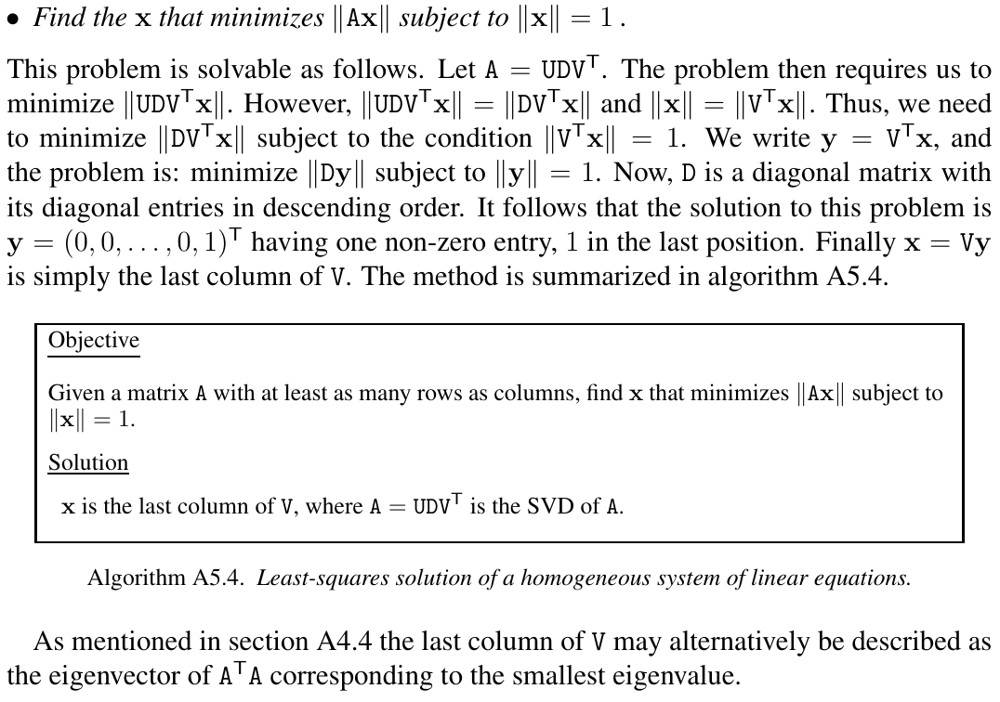

# 奇异值分解

假设 $\mathbf{M}$ 是一个 $m \times n$ 阶的矩阵，存在分解使得

$$\mathbf{M} = \mathbf{U} \mathbf{\Sigma} \mathbf{V}^{*}$$

其中 $\mathbf{U}$ 是一个 $m \times m$ 的酉矩阵，$\mathbf{\Sigma}$ 是 $m \times n$ 的非负实数对角矩阵，$\mathbf{V}$ 是 $n \times n$ 的酉矩阵。$\mathbf{\Sigma}$ 对角线上的元素为 $\mathbf{M}$ 的奇异值。


```tip
酉矩阵（unitary matrix）：共轭转置矩阵为其逆矩阵的复数方阵  
正交矩阵（orthogonal matrix）：转置矩阵为其逆矩阵的实数方阵
```

## 应用：求广义逆矩阵（伪逆）
若矩阵 $\mathbf{M}$ 的奇异值分解为 $\mathbf{M} = \mathbf{U} \mathbf{\Sigma} \mathbf{V}^{*}$，那么 $\mathbf{M}$ 的伪逆为 

$$\mathbf{M}^{+} = \mathbf{V} \mathbf{\Sigma}^{+} \mathbf{U}^{*} $$

其中 $\mathbf{\Sigma}^{+}$ 是 $\mathbf{\Sigma}$ 的伪逆，即将 $\mathbf{\Sigma}$ 主对角线上非零元素求倒之后转置。  
求伪逆通常可以用来求解最小二乘问题。

## 求齐次方程的最小二乘解
问题可转换为：在 $||\mathbf{x}|| = 1$ 的情况下，找到使得 $|| \mathbf{A} \mathbf{x} ||$ 最小的 $\mathbf{x}$ 。  




```note
$\mathbf{A}\mathbf{x} = \mathbf{0}$ 的最小二乘解为矩阵 $\mathbf{A}$ 的 SVD 分解得到的矩阵 $\mathbf{V}$ 的最后一列（或者说是矩阵 $\mathbf{V}^{T}$ 的最后一行）。
```

## 参考
[1] 视觉SLAM14讲  
[2] 维基百科编者. 奇异值分解[G/OL]. 维基百科, 2022(20221021)[2022-10-21]. https://zh.wikipedia.org/w/index.php?title=%E5%A5%87%E5%BC%82%E5%80%BC%E5%88%86%E8%A7%A3&oldid=74186303.  
[3] Least-squares solution of homogeneous equations
, Multiple View Geometry in Computer Vision, p592-593