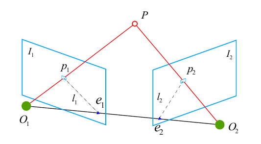

# 本质矩阵与基础矩阵

## 对极约束



其中，$O_1, O_2$ 为两个相机的中心，特征点 $p_1, p_2$ 为同一空间点 $P$ 在 $I_1, I_2$ 上的投影。  
- 相关术语  
`基线`： $O_1 O_2$  
`极点`： $e_1, e_2$，即 $O_1 O_2$ 连线 与 像平面 $I_1 I_2$ 的交点  
`极平面`： $O_1, O_2, P$ 三点确定的平面  
`极线`： $l_1, l_2$，即极平面与两个像平面 $I_1 I_2$ 之间的交线

### 对极约束推导
设 $\mathbf{x}_1, \mathbf{x}_2$ 为两个特征点在归一化平面上的坐标，有：  

$$ 
s_2 \mathbf{x}_2 = s_1 \mathbf{R} \mathbf{x}_1 + \mathbf{t} 
$$

两边同时左乘 $\mathbf{t}^{\wedge}$ ：

$$
s_2 \mathbf{t}^{\wedge} \mathbf{x}_2 = s_1 \mathbf{t}^{\wedge} \mathbf{R} \mathbf{x}_1
$$

两边同时左乘 $\mathbf{x}_2^{T}$ ：

$$
\begin{aligned}
s_2 \mathbf{x}_2^{T} \mathbf{t}^{\wedge} \mathbf{x}_2 &= s_1 \mathbf{x}_2^{T} \mathbf{t}^{\wedge} \mathbf{R} \mathbf{x}_1 \\
0 &= s_1 \mathbf{x}_2^{T} \mathbf{t}^{\wedge} \mathbf{R} \mathbf{x}_1 \\
\mathbf{x}_2^{T} \mathbf{t}^{\wedge} \mathbf{R} \mathbf{x}_1 &= 0
\end{aligned}
$$

以上即是对极约束。如果使用像素坐标描述，可以写成

$$
\mathbf{p}_2^{T} \mathbf{K}^{-T} \mathbf{t}^{\wedge} \mathbf{R} \mathbf{K}^{-1} \mathbf{p}_1 = 0
$$

对极约束的几何意义是 $O_1, P, O_2$ 三点共面。

对极约束的中间部分分别是 本质矩阵（Essential Matrix）和 基础矩阵（Fundamental Matrix）：  

$$
\begin{aligned}
\mathbf{E} &= \mathbf{t}^{\wedge} \mathbf{R} \\
\mathbf{F} &= \mathbf{K}^{-T} \mathbf{t}^{\wedge} \mathbf{R} \mathbf{K}^{-1}
\end{aligned}
$$

得到本质矩阵或者基础矩阵后，就可以进一步计算相机的运动。

## 本质矩阵

本质矩阵的特性：  
- 尺度等价性：乘以任意非零常数后对极约束依然满足。
- 内在性质：本质矩阵的奇异值必定是 $[\sigma, \sigma, 0]$ 的形式。
- 由于平移和旋转各有3个自由度，因此本质矩阵 $\mathbf{E} = \mathbf{t}^{\wedge} \mathbf{R}$ 有6个自由度，但是由于尺度等价性，$\mathbf{E}$ 实际上只有5个自由度。

本质矩阵 $\mathbf{E}$ 有5个自由度，因此最少可以使用5对点来求解。但是由于 $\mathbf{E}$ 的内在性质是一种非线性性质，在求解线性方程时会带来麻烦，因此一般只考虑它的尺度等价性，使用8对点来估计 $\mathbf{E}$ ，即**八点法**。

## ORB-SLAM 中求解基础矩阵代码

### 匹配点尺度归一化

```cpp

/**
 * @brief 归一化特征点到同一尺度，作为后续normalize DLT的输入
 *  [x' y' 1]' = T * [x y 1]' 
 *  归一化后x', y'的均值为0，sum(abs(x_i'-0))=1，sum(abs((y_i'-0))=1
 *
 *  为什么要归一化？
 *  在相似变换之后(点在不同的坐标系下),他们的单应性矩阵是不相同的
 *  如果图像存在噪声,使得点的坐标发生了变化,那么它的单应性矩阵也会发生变化
 *  我们采取的方法是将点的坐标放到同一坐标系下,并将缩放尺度也进行统一 
 *  对同一幅图像的坐标进行相同的变换,不同图像进行不同变换
 *  缩放尺度是为了让噪声对于图像的影响在一个数量级上
 * 
 *  Step 1 计算特征点X,Y坐标的均值 
 *  Step 2 计算特征点X,Y坐标离均值的平均偏离程度
 *  Step 3 将x坐标和y坐标分别进行尺度归一化，使得x坐标和y坐标的一阶绝对矩分别为1 
 *  Step 4 计算归一化矩阵：其实就是前面做的操作用矩阵变换来表示而已
 * 
 * @param[in] vKeys                               待归一化的特征点
 * @param[in & out] vNormalizedPoints             特征点归一化后的坐标
 * @param[in & out] T                             归一化特征点的变换矩阵
 */
void Initializer::Normalize(const vector<cv::KeyPoint> &vKeys, vector<cv::Point2f> &vNormalizedPoints, cv::Mat &T)                           //将特征点归一化的矩阵
{
    // 归一化的是这些点在x方向和在y方向上的一阶绝对矩（随机变量的期望）。

    // Step 1 计算特征点X,Y坐标的均值 meanX, meanY
    float meanX = 0;
    float meanY = 0;

	//获取特征点的数量
    const int N = vKeys.size();

	//设置用来存储归一后特征点的向量大小，和归一化前保持一致
    vNormalizedPoints.resize(N);

	//开始遍历所有的特征点
    for(int i=0; i<N; i++)
    {
		//分别累加特征点的X、Y坐标
        meanX += vKeys[i].pt.x;
        meanY += vKeys[i].pt.y;
    }

    //计算X、Y坐标的均值
    meanX = meanX/N;
    meanY = meanY/N;

    // Step 2 计算特征点X,Y坐标离均值的平均偏离程度 meanDevX, meanDevY，注意不是标准差
    float meanDevX = 0;
    float meanDevY = 0;

    // 将原始特征点减去均值坐标，使x坐标和y坐标均值分别为0
    for(int i=0; i<N; i++)
    {
        vNormalizedPoints[i].x = vKeys[i].pt.x - meanX;
        vNormalizedPoints[i].y = vKeys[i].pt.y - meanY;

		//累计这些特征点偏离横纵坐标均值的程度
        meanDevX += fabs(vNormalizedPoints[i].x);
        meanDevY += fabs(vNormalizedPoints[i].y);
    }

    // 求出平均到每个点上，其坐标偏离横纵坐标均值的程度；将其倒数作为一个尺度缩放因子
    meanDevX = meanDevX/N;
    meanDevY = meanDevY/N;
    float sX = 1.0/meanDevX;
    float sY = 1.0/meanDevY;

    // Step 3 将x坐标和y坐标分别进行尺度归一化，使得x坐标和y坐标的一阶绝对矩分别为1 
    // 这里所谓的一阶绝对矩其实就是随机变量到取值的中心的绝对值的平均值（期望）
    for(int i=0; i<N; i++)
    {
		//对，就是简单地对特征点的坐标进行进一步的缩放
        vNormalizedPoints[i].x = vNormalizedPoints[i].x * sX;
        vNormalizedPoints[i].y = vNormalizedPoints[i].y * sY;
    }

    // Step 4 计算归一化矩阵：其实就是前面做的操作用矩阵变换来表示而已
    // |sX  0  -meanx*sX|
    // |0   sY -meany*sY|
    // |0   0      1    |
    T = cv::Mat::eye(3,3,CV_32F);
    T.at<float>(0,0) = sX;
    T.at<float>(1,1) = sY;
    T.at<float>(0,2) = -meanX*sX;
    T.at<float>(1,2) = -meanY*sY;
}
```

### 求解基础矩阵

```cpp

/**
 * @brief 根据特征点匹配求fundamental matrix（normalized 8点法）
 * 注意F矩阵有秩为2的约束，所以需要两次SVD分解
 * 
 * @param[in] vP1           参考帧中归一化后的特征点
 * @param[in] vP2           当前帧中归一化后的特征点
 * @return cv::Mat          最后计算得到的基础矩阵F
 */
cv::Mat Initializer::ComputeF21(
    const vector<cv::Point2f> &vP1, //归一化后的点, in reference frame
    const vector<cv::Point2f> &vP2) //归一化后的点, in current frame
{
    // 原理详见附件推导
    // x'Fx = 0 整理可得：Af = 0
    // A = | x'x x'y x' y'x y'y y' x y 1 |, f = | f1 f2 f3 f4 f5 f6 f7 f8 f9 |
    // 通过SVD求解Af = 0，A'A最小特征值对应的特征向量即为解

	//获取参与计算的特征点对数
    const int N = vP1.size();

	//初始化A矩阵
    cv::Mat A(N,9,CV_32F); // N*9维

    // 构造矩阵A，将每个特征点添加到矩阵A中的元素
    for(int i=0; i<N; i++)
    {
        const float u1 = vP1[i].x;
        const float v1 = vP1[i].y;
        const float u2 = vP2[i].x;
        const float v2 = vP2[i].y;

        A.at<float>(i,0) = u2*u1;
        A.at<float>(i,1) = u2*v1;
        A.at<float>(i,2) = u2;
        A.at<float>(i,3) = v2*u1;
        A.at<float>(i,4) = v2*v1;
        A.at<float>(i,5) = v2;
        A.at<float>(i,6) = u1;
        A.at<float>(i,7) = v1;
        A.at<float>(i,8) = 1;
    }

    //存储奇异值分解结果的变量
    cv::Mat u,w,vt;

    // 定义输出变量，u是左边的正交矩阵U， w为奇异矩阵，vt中的t表示是右正交矩阵V的转置
    cv::SVDecomp(A,w,u,vt,cv::SVD::MODIFY_A | cv::SVD::FULL_UV);
	// 转换成基础矩阵的形式
    cv::Mat Fpre = vt.row(8).reshape(0, 3); // vt的最后一行，即v的最后一列

    // 基础矩阵的秩为2,而我们不敢保证计算得到的这个结果的秩为2,所以需要通过第二次奇异值分解,来强制使其秩为2
    // 对初步得来的基础矩阵进行第2次奇异值分解
    cv::SVDecomp(Fpre,w,u,vt,cv::SVD::MODIFY_A | cv::SVD::FULL_UV);

	// 秩2约束，强制将第3个奇异值设置为0
    w.at<float>(2)=0; 
    
    // 重新组合好满足秩约束的基础矩阵，作为最终计算结果返回 
    return  u*cv::Mat::diag(w)*vt;
}
```

### 根据对极约束对基础矩阵进行打分

```cpp

/**
 * @brief 对给定的Fundamental matrix打分
 * 
 * @param[in] F21                       当前帧和参考帧之间的基础矩阵
 * @param[in] vbMatchesInliers          匹配的特征点对属于inliers的标记
 * @param[in] sigma                     方差，默认为1
 * @return float                        返回得分
 */
float Initializer::CheckFundamental(
    const cv::Mat &F21,             //当前帧和参考帧之间的基础矩阵
    vector<bool> &vbMatchesInliers, //匹配的特征点对属于inliers的标记
    float sigma)                    //方差
{

    // 说明：在已值n维观测数据误差服从N(0，sigma）的高斯分布时
    // 其误差加权最小二乘结果为  sum_error = SUM(e(i)^T * Q^(-1) * e(i))
    // 其中：e(i) = [e_x,e_y,...]^T, Q维观测数据协方差矩阵，即sigma * sigma组成的协方差矩阵
    // 误差加权最小二次结果越小，说明观测数据精度越高
    // 那么，score = SUM((th - e(i)^T * Q^(-1) * e(i)))的分数就越高
    // 算法目标：检查基础矩阵
    // 检查方式：利用对极几何原理 p2^T * F * p1 = 0
    // 假设：三维空间中的点 P 在 img1 和 img2 两图像上的投影分别为 p1 和 p2（两个为同名点）
    //   则：p2 一定存在于极线 l2 上，即 p2*l2 = 0. 而l2 = F*p1 = (a, b, c)^T
    //      所以，这里的误差项 e 为 p2 到 极线 l2 的距离，如果在直线上，则 e = 0
    //      根据点到直线的距离公式：d = (ax + by + c) / sqrt(a * a + b * b)
    //      所以，e =  (a * p2.x + b * p2.y + c) /  sqrt(a * a + b * b)

	// 获取匹配的特征点对的总对数
    const int N = mvMatches12.size();

	// Step 1 提取基础矩阵中的元素数据
    const float f11 = F21.at<float>(0,0);
    const float f12 = F21.at<float>(0,1);
    const float f13 = F21.at<float>(0,2);
    const float f21 = F21.at<float>(1,0);
    const float f22 = F21.at<float>(1,1);
    const float f23 = F21.at<float>(1,2);
    const float f31 = F21.at<float>(2,0);
    const float f32 = F21.at<float>(2,1);
    const float f33 = F21.at<float>(2,2);

	// 预分配空间
    vbMatchesInliers.resize(N);

	// 设置评分初始值（因为后面需要进行这个数值的累计）
    float score = 0;

    // 基于卡方检验计算出的阈值
	// 自由度为1的卡方分布，显著性水平为0.05，对应的临界阈值
    // ?是因为点到直线距离是一个自由度吗？
    const float th = 3.841;

    // 自由度为2的卡方分布，显著性水平为0.05，对应的临界阈值
    const float thScore = 5.991;

	// 信息矩阵，或 协方差矩阵的逆矩阵
    const float invSigmaSquare = 1.0/(sigma*sigma);


    // Step 2 计算img1 和 img2 在估计 F 时的score值
    for(int i=0; i<N; i++)
    {
		//默认为这对特征点是Inliers
        bool bIn = true;

	    // Step 2.1 提取参考帧和当前帧之间的特征匹配点对
        const cv::KeyPoint &kp1 = mvKeys1[mvMatches12[i].first];
        const cv::KeyPoint &kp2 = mvKeys2[mvMatches12[i].second];

		// 提取出特征点的坐标
        const float u1 = kp1.pt.x;
        const float v1 = kp1.pt.y;
        const float u2 = kp2.pt.x;
        const float v2 = kp2.pt.y;

        // Reprojection error in second image
        // Step 2.2 计算 img1 上的点在 img2 上投影得到的极线 l2 = F21 * p1 = (a2,b2,c2)
		const float a2 = f11*u1+f12*v1+f13;
        const float b2 = f21*u1+f22*v1+f23;
        const float c2 = f31*u1+f32*v1+f33;
    
        // Step 2.3 计算误差 e = (a * p2.x + b * p2.y + c) /  sqrt(a * a + b * b)
        const float num2 = a2*u2+b2*v2+c2;
        const float squareDist1 = num2*num2/(a2*a2+b2*b2);
        // 带权重误差
        const float chiSquare1 = squareDist1*invSigmaSquare;
		
        // Step 2.4 误差大于阈值就说明这个点是Outlier 
        // ? 为什么判断阈值用的 th（1自由度），计算得分用的thScore（2自由度）
        // ? 可能是为了和CheckHomography 得分统一？
        if(chiSquare1>th)
            bIn = false;
        else
            // 误差越大，得分越低
            score += thScore - chiSquare1;

        // 计算img2上的点在 img1 上投影得到的极线 l1= p2 * F21 = (a1,b1,c1)
        const float a1 = f11*u2+f21*v2+f31;
        const float b1 = f12*u2+f22*v2+f32;
        const float c1 = f13*u2+f23*v2+f33;

        // 计算误差 e = (a * p2.x + b * p2.y + c) /  sqrt(a * a + b * b)
        const float num1 = a1*u1+b1*v1+c1;
        const float squareDist2 = num1*num1/(a1*a1+b1*b1);

        // 带权重误差
        const float chiSquare2 = squareDist2*invSigmaSquare;

        // 误差大于阈值就说明这个点是Outlier 
        if(chiSquare2>th)
            bIn = false;
        else
            score += thScore - chiSquare2;
        
        // Step 2.5 保存结果
        if(bIn)
            vbMatchesInliers[i]=true;
        else
            vbMatchesInliers[i]=false;
    }
    //  返回评分
    return score;
}
```

### RANSAC 迭代

```cpp

/**
 * @brief 计算基础矩阵，假设场景为非平面情况下通过前两帧求取Fundamental矩阵，得到该模型的评分
 * Step 1 将当前帧和参考帧中的特征点坐标进行归一化
 * Step 2 选择8个归一化之后的点对进行迭代
 * Step 3 八点法计算基础矩阵矩阵
 * Step 4 利用重投影误差为当次RANSAC的结果评分
 * Step 5 更新具有最优评分的基础矩阵计算结果,并且保存所对应的特征点对的内点标记
 * 
 * @param[in & out] vbMatchesInliers          标记是否是外点
 * @param[in & out] score                     计算基础矩阵得分
 * @param[in & out] F21                       从特征点1到2的基础矩阵
 */
void Initializer::FindFundamental(vector<bool> &vbMatchesInliers, float &score, cv::Mat &F21)
{
    // 计算基础矩阵,其过程和上面的计算单应矩阵的过程十分相似.

    // Number of putative matches
	// 匹配的特征点对总数
    // const int N = vbMatchesInliers.size();  // !源代码出错！请使用下面代替
    const int N = mvMatches12.size();
    // Normalize coordinates
    // Step 1 将当前帧和参考帧中的特征点坐标进行归一化，主要是平移和尺度变换
    // 具体来说,就是将mvKeys1和mvKey2归一化到均值为0，一阶绝对矩为1，归一化矩阵分别为T1、T2
    // 这里所谓的一阶绝对矩其实就是随机变量到取值的中心的绝对值的平均值
    // 归一化矩阵就是把上述归一化的操作用矩阵来表示。这样特征点坐标乘归一化矩阵可以得到归一化后的坐标

    vector<cv::Point2f> vPn1, vPn2;
    cv::Mat T1, T2;
    Normalize(mvKeys1,vPn1, T1);
    Normalize(mvKeys2,vPn2, T2);
	// ! 注意这里取的是归一化矩阵T2的转置,因为基础矩阵的定义和单应矩阵不同，两者去归一化的计算也不相同
    cv::Mat T2t = T2.t();

    // Best Results variables
	//最优结果
    score = 0.0;
    vbMatchesInliers = vector<bool>(N,false);

    // Iteration variables
	// 某次迭代中，参考帧的特征点坐标
    vector<cv::Point2f> vPn1i(8);
    // 某次迭代中，当前帧的特征点坐标
    vector<cv::Point2f> vPn2i(8);
    // 某次迭代中，计算的基础矩阵
    cv::Mat F21i;

    // 每次RANSAC记录的Inliers与得分
    vector<bool> vbCurrentInliers(N,false);
    float currentScore;

    // Perform all RANSAC iterations and save the solution with highest score
    // 下面进行每次的RANSAC迭代
    for(int it=0; it<mMaxIterations; it++)
    {
        // Select a minimum set
        // Step 2 选择8个归一化之后的点对进行迭代
        for(int j=0; j<8; j++)
        {
            int idx = mvSets[it][j];

            // vPn1i和vPn2i为匹配的特征点对的归一化后的坐标
			// 首先根据这个特征点对的索引信息分别找到两个特征点在各自图像特征点向量中的索引，然后读取其归一化之后的特征点坐标
            vPn1i[j] = vPn1[mvMatches12[idx].first];        //first存储在参考帧1中的特征点索引
            vPn2i[j] = vPn2[mvMatches12[idx].second];       //second存储在参考帧1中的特征点索引
        }

        // Step 3 八点法计算基础矩阵
        cv::Mat Fn = ComputeF21(vPn1i,vPn2i);

        // 基础矩阵约束：p2^t*F21*p1 = 0，其中p1,p2 为齐次化特征点坐标    
        // 特征点归一化：vPn1 = T1 * mvKeys1, vPn2 = T2 * mvKeys2  
        // 根据基础矩阵约束得到:(T2 * mvKeys2)^t* Hn * T1 * mvKeys1 = 0   
        // 进一步得到:mvKeys2^t * T2^t * Hn * T1 * mvKeys1 = 0
        F21i = T2t*Fn*T1;

        // Step 4 利用重投影误差为当次RANSAC的结果评分
        currentScore = CheckFundamental(F21i, vbCurrentInliers, mSigma);

		// Step 5 更新具有最优评分的基础矩阵计算结果,并且保存所对应的特征点对的内点标记
        if(currentScore>score)
        {
            // 如果当前的结果得分更高，那么就更新最优计算结果
            F21 = F21i.clone();
            vbMatchesInliers = vbCurrentInliers;
            score = currentScore;
        }
    }
}
```

### 由基础矩阵恢复相机位姿变换

```cpp

/**
 * @brief 从基础矩阵F中求解位姿R，t及三维点
 * F分解出E，E有四组解，选择计算的有效三维点（在摄像头前方、投影误差小于阈值、视差角大于阈值）最多的作为最优的解
 * @param[in] vbMatchesInliers          匹配好的特征点对的Inliers标记
 * @param[in] F21                       从参考帧到当前帧的基础矩阵
 * @param[in] K                         相机的内参数矩阵
 * @param[in & out] R21                 计算好的相机从参考帧到当前帧的旋转
 * @param[in & out] t21                 计算好的相机从参考帧到当前帧的平移
 * @param[in & out] vP3D                三角化测量之后的特征点的空间坐标
 * @param[in & out] vbTriangulated      特征点三角化成功的标志
 * @param[in] minParallax               认为三角化有效的最小视差角
 * @param[in] minTriangulated           最小三角化点数量
 * @return true                         成功初始化
 * @return false                        初始化失败
 */
bool Initializer::ReconstructF(vector<bool> &vbMatchesInliers, cv::Mat &F21, cv::Mat &K,
                            cv::Mat &R21, cv::Mat &t21, vector<cv::Point3f> &vP3D, vector<bool> &vbTriangulated, float minParallax, int minTriangulated)
{
    // Step 1 统计有效匹配点个数，并用 N 表示
    // vbMatchesInliers 中存储匹配点对是否是有效
    int N=0;
    for(size_t i=0, iend = vbMatchesInliers.size() ; i<iend; i++)
        if(vbMatchesInliers[i]) N++;
    
    cout << "num of inliers: " << N << endl;

    // Step 2 根据基础矩阵和相机的内参数矩阵计算本质矩阵
    cv::Mat E21 = K.t()*F21*K;

    // 定义本质矩阵分解结果，形成四组解,分别是：
    // (R1, t) (R1, -t) (R2, t) (R2, -t)
    cv::Mat R1, R2, t;

    // Step 3 从本质矩阵求解两个R解和两个t解，共四组解
    // 不过由于两个t解互为相反数，因此这里先只获取一个
    // 虽然这个函数对t有归一化，但并没有决定单目整个SLAM过程的尺度. 
    // 因为 CreateInitialMapMonocular 函数对3D点深度会缩放，然后反过来对 t 有改变.
    //注意下文中的符号“'”表示矩阵的转置
    //                          |0 -1  0|
    // E = U Sigma V'   let W = |1  0  0|
    //                          |0  0  1|
    // 得到4个解 E = [R|t]
    // R1 = UWV' R2 = UW'V' t1 = U3 t2 = -U3
    DecomposeE(E21,R1,R2,t);  
    cv::Mat t1=t;
    cv::Mat t2=-t;

    // Reconstruct with the 4 hyphoteses and check
    // Step 4 分别验证求解的4种R和t的组合，选出最佳组合
    // 原理：若某一组合使恢复得到的3D点位于相机正前方的数量最多，那么该组合就是最佳组合
    // 实现：根据计算的解组合成为四种情况,并依次调用 Initializer::CheckRT() 进行检查,得到可以进行三角化测量的点的数目
	// 定义四组解分别在对同一匹配点集进行三角化测量之后的特征点空间坐标
    vector<cv::Point3f> vP3D1, vP3D2, vP3D3, vP3D4;

	// 定义四组解分别对同一匹配点集的有效三角化结果，True or False
    vector<bool> vbTriangulated1,vbTriangulated2,vbTriangulated3, vbTriangulated4;

	// 定义四种解对应的比较大的特征点对视差角
    float parallax1,parallax2, parallax3, parallax4;

	// Step 4.1 使用同样的匹配点分别检查四组解，记录当前计算的3D点在摄像头前方且投影误差小于阈值的个数，记为有效3D点个数
    int nGood1 = CheckRT(R1,t1,							//当前组解
						 mvKeys1,mvKeys2,				//参考帧和当前帧中的特征点
						 mvMatches12, vbMatchesInliers,	//特征点的匹配关系和Inliers标记
						 K, 							//相机的内参数矩阵
						 vP3D1,							//存储三角化以后特征点的空间坐标
						 4.0*mSigma2,					//三角化测量过程中允许的最大重投影误差
						 vbTriangulated1,				//参考帧中被成功进行三角化测量的特征点的标记
						 parallax1);					//认为某对特征点三角化测量有效的比较大的视差角
    int nGood2 = CheckRT(R2,t1,mvKeys1,mvKeys2,mvMatches12,vbMatchesInliers,K, vP3D2, 4.0*mSigma2, vbTriangulated2, parallax2);
    int nGood3 = CheckRT(R1,t2,mvKeys1,mvKeys2,mvMatches12,vbMatchesInliers,K, vP3D3, 4.0*mSigma2, vbTriangulated3, parallax3);
    int nGood4 = CheckRT(R2,t2,mvKeys1,mvKeys2,mvMatches12,vbMatchesInliers,K, vP3D4, 4.0*mSigma2, vbTriangulated4, parallax4);

    // Step 4.2 选取最大可三角化测量的点的数目
    int maxGood = max(nGood1,max(nGood2,max(nGood3,nGood4)));

	// 重置变量，并在后面赋值为最佳R和T
    R21 = cv::Mat();
    t21 = cv::Mat();

    // Step 4.3 确定最小的可以三角化的点数 
    // 在0.9倍的内点数 和 指定值minTriangulated =50 中取最大的，也就是说至少50个
    int nMinGood = max(static_cast<int>(0.9*N), minTriangulated);

	// 统计四组解中重建的有效3D点个数 > 0.7 * maxGood 的解的数目
    // 如果有多个解同时满足该条件，认为结果太接近，nsimilar++，nsimilar>1就认为有问题了，后面返回false
    int nsimilar = 0;
    if(nGood1>0.7*maxGood)
        nsimilar++;
    if(nGood2>0.7*maxGood)
        nsimilar++;
    if(nGood3>0.7*maxGood)
        nsimilar++;
    if(nGood4>0.7*maxGood)
        nsimilar++;

    // Step 4.4 四个结果中如果没有明显的最优结果，或者没有足够数量的三角化点，则返回失败
    // 条件1: 如果四组解能够重建的最多3D点个数小于所要求的最少3D点个数（mMinGood），失败
    // 条件2: 如果存在两组及以上的解能三角化出 >0.7*maxGood的点，说明没有明显最优结果，失败
    if(maxGood<nMinGood || nsimilar>1){
        cout << "maxGood too small or nsimilar bigger than 1." << endl;
        return false;
    }

    //  Step 4.5 选择最佳解记录结果
    // 条件1: 有效重建最多的3D点，即maxGood == nGoodx，也即是位于相机前方的3D点个数最多
    // 条件2: 三角化视差角 parallax 必须大于最小视差角 minParallax，角度越大3D点越稳定

    //看看最好的good点是在哪种解的条件下发生的
    cout << "maxGood: " << maxGood << endl;
    if(maxGood==nGood1)
    {
		//如果该种解下的parallax大于函数参数中给定的最小值
        if(parallax1>minParallax)
        {
            // 存储3D坐标
            vP3D = vP3D1;

			// 获取特征点向量的三角化测量标记
            vbTriangulated = vbTriangulated1;

			// 存储相机姿态
            R1.copyTo(R21);
            t1.copyTo(t21);
			
            // 结束
            return true;
        }
    }else if(maxGood==nGood2)
    {
        if(parallax2>minParallax)
        {
            vP3D = vP3D2;
            vbTriangulated = vbTriangulated2;

            R2.copyTo(R21);
            t1.copyTo(t21);
            return true;
        }
    }else if(maxGood==nGood3)
    {
        if(parallax3>minParallax)
        {
            vP3D = vP3D3;
            vbTriangulated = vbTriangulated3;

            R1.copyTo(R21);
            t2.copyTo(t21);
            return true;
        }
    }else if(maxGood==nGood4)
    {
        if(parallax4>minParallax)
        {
            vP3D = vP3D4;
            vbTriangulated = vbTriangulated4;

            R2.copyTo(R21);
            t2.copyTo(t21);
            return true;
        }
    }

    // 
    // 如果有最优解但是不满足对应的parallax>minParallax，那么返回false表示求解失败
    cout << "Parallax error. " << endl;

    return false;
}

/**
 * @brief 分解Essential矩阵得到R,t
 * 分解E矩阵将得到4组解，这4组解分别为[R1,t],[R1,-t],[R2,t],[R2,-t]
 * 参考：Multiple View Geometry in Computer Vision - Result 9.19 p259
 * @param[in] E                 本质矩阵
 * @param[in & out] R1          旋转矩阵1
 * @param[in & out] R2          旋转矩阵2
 * @param[in & out] t           平移向量，另外一个取相反数
 */
void Initializer::DecomposeE(const cv::Mat &E, cv::Mat &R1, cv::Mat &R2, cv::Mat &t)
{

    // 对本质矩阵进行奇异值分解
	//准备存储对本质矩阵进行奇异值分解的结果
    cv::Mat u,w,vt;
	//对本质矩阵进行奇异值分解
    cv::SVD::compute(E,w,u,vt);

    // 左奇异值矩阵U的最后一列就是t，对其进行归一化
    u.col(2).copyTo(t);
    t=t/cv::norm(t);

    // 构造一个绕Z轴旋转pi/2的旋转矩阵W，按照下式组合得到旋转矩阵 R1 = u*W*vt
    //计算完成后要检查一下旋转矩阵行列式的数值，使其满足行列式为1的约束
    cv::Mat W(3,3,CV_32F,cv::Scalar(0));
    W.at<float>(0,1)=-1;
    W.at<float>(1,0)=1;
    W.at<float>(2,2)=1;

	//计算
    R1 = u*W*vt;
	//旋转矩阵有行列式为+1的约束，所以如果算出来为负值，需要取反
    if(cv::determinant(R1)<0) 
        R1=-R1;

	// 同理将矩阵W取转置来按照相同的公式计算旋转矩阵R2 = u*W.t()*vt

    R2 = u*W.t()*vt;
	//旋转矩阵有行列式为1的约束
    if(cv::determinant(R2)<0)
        R2=-R2;
}
```